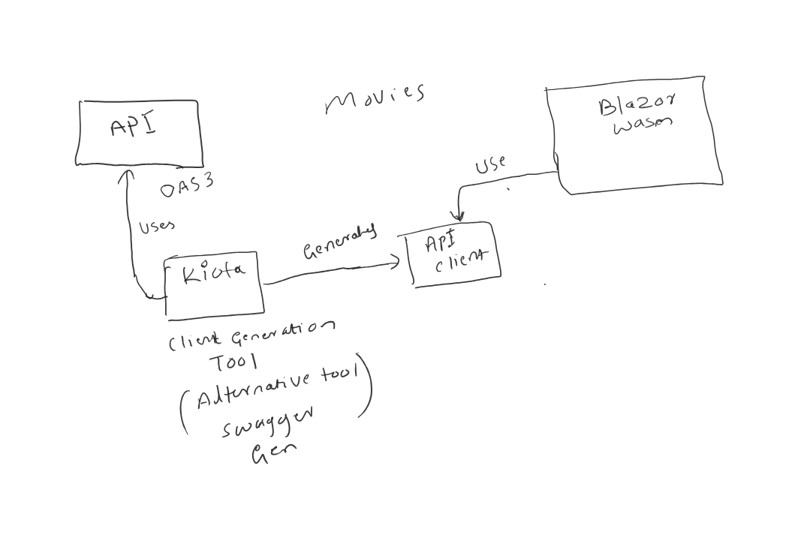

# Install Kiota as a tool

dotnet tool install --global Microsoft.OpenApi.Kiota

# Intsall Kiota deps

`
dotnet add package Microsoft.Kiota.Abstractions  
dotnet add package Microsoft.Kiota.Http.HttpClientLibrary  
dotnet add package Microsoft.Kiota.Serialization.Form  
dotnet add package Microsoft.Kiota.Serialization.Json  
dotnet add package Microsoft.Kiota.Serialization.Text  
dotnet add package Microsoft.Kiota.Serialization.Multipart  
`

# To Create Client Application , Save OpenAPI OAS 3 as Movies-OpenApi.yaml from swagger page of web api and use below command to generate client

kiota generate -l CSharp -c MoviesClient -n KiotaMovies.Client -d ./OAS/Movies-OpenApi.yaml -o ./MovieClient

# Use Generated Client MovieClient in the web app to make request to the api, it provide client with reach strongly typed client
